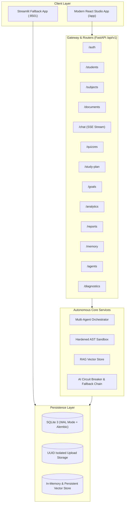

# Autonomous Student Intelligence Platform (ASIP V2.0)
### AI Student Copilot — Full-Stack Autonomous Learning, Exam Preparation & Multi-Agent Tutoring System


-brightgreen.svg)


---

## 📌 Executive Overview

The **Autonomous Student Intelligence Platform (ASIP V2.0)** is an enterprise-grade, local-first academic platform combining:
1. **Autonomous Multi-Agent Orchestration**: Explainable state-machine pipeline (`RECEIVED` $\rightarrow$ `CLASSIFYING` $\rightarrow$ `PLANNING` $\rightarrow$ `TOOL_EXECUTION` $\rightarrow$ `SYNTHESIZING` $\rightarrow$ `SELF_EVALUATION` $\rightarrow$ `COMPLETED`).
2. **Resilient AI Reasoning**: Primary `gemini-2.5-flash` with circuit breaker and automatic fallback to `gemini-1.5-pro` or `gpt-4o-mini`.
3. **Hardened Execution Sandbox**: Restricted AST sandbox with statement-depth limits, safety visitor, and isolated thread execution.
4. **Academic RAG Pipeline**: Ingestion pipeline with binary magic-byte MIME validation, UUID storage, and grounded citation excerpts with page numbers.
5. **Calm Study Studio Modern Frontend**: React 18, TypeScript, Vite, Tailwind CSS, self-hosted fonts, and resilient SSE streaming with keepalive pings and provider-switch recovery.
6. **Dual Availability**: Full backward compatibility preserving the original Streamlit Community Cloud frontend on `main` while providing the production React/FastAPI stack on `v2-upgrade`.

---

## 🏗️ Architecture & Component Topology



---

## 🚀 Quick Start

### Option 1: Docker Compose (Zero Configuration)

```bash
# 1. Clone repository
git clone https://github.com/Tejasai784/AI-Student-Copilot.git
cd AI-Student-Copilot

# 2. Set up environment
cp .env.example .env
# Add your GEMINI_API_KEY to .env

# 3. Launch full stack
docker compose up -d --build

# 4. Open in browser:
# - React Modern Web Studio: http://localhost:8000/app
# - OpenAPI Swagger UI:     http://localhost:8000/docs
# - Streamlit Fallback UI:  http://localhost:8501
```

### Option 2: Local Development Setup

```bash
# 1. Python virtual environment
python -m venv .venv
source .venv/bin/activate  # On Windows: .venv\Scripts\activate
pip install -r requirements.txt

# 2. Database migrations
alembic upgrade head

# 3. React Frontend Build
cd frontend
npm ci
npm run build
cd ..

# 4. Run unified FastAPI server
uvicorn backend.main:app --host 0.0.0.0 --port 8000 --reload
```

---

## 🧪 Comprehensive Automated Test Suite

ASIP V2.0 features an automated test regression suite covering all 8 development phases:

```bash
# Run complete test suite (84 tests)
python -m pytest -v

# Target specific modules
python -m pytest tests/test_phase6_frontend.py -v   # Frontend build & SSE chat streaming
python -m pytest tests/test_phase7_pages.py -v      # All 16 pages and REST API integration
python -m pytest tests/test_phase4_orchestration.py # Multi-agent state machine & AST sandbox
```

### Verification Matrix
- **Total Tests Passed**: **84 passed, 0 failed, 3 warnings** (100% pass rate).
- **Frontend Build**: `tsc -b && vite build` generates clean production assets in `< 10s` with zero TypeScript errors.
- **Security Check**: AST execution sandbox blocks all arbitrary shell commands and filesystem traversal attempts.

---

## 📚 Platform Features & Pages

| Feature / Page | Route | Description |
| :--- | :--- | :--- |
| **Today Dashboard** | `/app` (Dashboard) | Asymmetric hero card, circular SVG progress ring, primary study action, weak topic alert. |
| **AI Academic Tutor** | `/app` (Chat) | Centered reading column, SSE streaming, source citation chips drawer, agent trace timeline. |
| **Course Materials** | `/app` (Materials) | Drag-and-drop file upload, MIME validation, status pipeline, vector chunk inspector. |
| **Knowledge Base** | `/app` (Knowledge) | Semantic vector retrieval with similarity scores, citation excerpts, topic mastery graph. |
| **Syllabus & Topics** | `/app` (Syllabus) | Unit trees, syllabus topic completion checkboxes, per-subject progress meters. |
| **Practice Quizzes** | `/app` (Quizzes) | Targeted quiz generator, question stepper (MCQ, T/F, Code), instant grading & explanations. |
| **Mock Exams** | `/app` (Mock Exams) | Full-length timed mock exams, countdown timer, auto-submit on expiry, section navigation. |
| **Study Planner** | `/app` (Planner) | 7-day adaptive timeline schedule, daily study intervals, priority sorting. |
| **Goals & Tasks** | `/app` (Goals) | Natural language autonomous goal decomposition, milestone checklists, task toggle. |
| **Weak Topics** | `/app` (Weaknesses) | Error pattern analysis, weak topic radar, 1-click targeted remediation. |
| **Progress Analytics**| `/app` (Analytics) | Study velocity, accuracy metrics, subject mastery comparison bars, trend cards. |
| **Readiness Reports** | `/app` (Reports) | Academic readiness index meter, strengths/gaps, executive report preview, MD/HTML exports. |
| **Personalization** | `/app` (Memory) | Long-term memory cards, learning preferences, secret filter indicator. |
| **Agent Traces** | `/app` (Agents) | Multi-agent state transitions, tool invocation latency logs, self-evaluation scores. |
| **Settings & Profile**| `/app` (Settings) | Student identity editor, explanation style preferences, WCAG AA theme toggle. |
| **Diagnostics** | `/app` (Diagnostics) | System vitals, SQLite WAL status, vector chunk counts, storage footprint. |

---

## 📖 Complete Documentation
- [Architecture Guide](docs/ARCHITECTURE.md)
- [REST & Streaming API Reference](docs/API.md)
- [Production Deployment Guide](docs/DEPLOYMENT.md)
- [Architecture Decision Records (ADRs)](docs/DECISIONS.md)
- [Changelog](docs/CHANGELOG.md)
- [Baseline Audit](docs/AUDIT.md)

---

## 📄 License
Licensed under the [MIT License](LICENSE).
