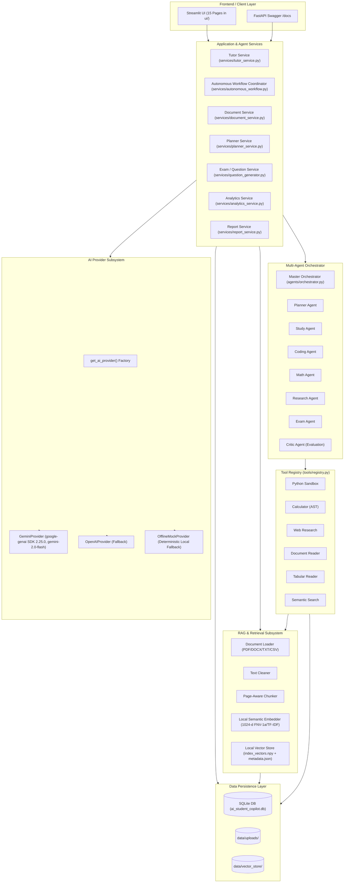

# AI Student Copilot V2.0 — Comprehensive Phase 0 Project Audit

**Audit Date:** 2026-10-01  
**Project Path:** `D:\AI_Student_Copilot`  
**Git Checkpoint:** Tag `pre-v2`, Branch `v2-upgrade`  
**Status:** Baseline Established — No Application Code Modified  

---

## 1. Current Architecture, Module Map & Data Flow

### Architecture Overview
The current platform operates as a dual-runtime Python system:
1. **FastAPI Application (`backend/main.py`)**: Exposes REST endpoints (`/docs`, `/api/profile`, `/api/subjects`, `/api/documents`, `/api/tutor/ask`, `/api/goals`, `/api/autonomous/prepare`, etc.).
2. **Streamlit Multi-Page UI (`app.py`, `ui/`)**: A 15-page interactive web interface interfacing directly with Python application services and the SQLite database.
3. **Application Services (`services/`)**: Orchestrates RAG retrieval, tutoring, goal decomposition, study scheduling, analytics, reporting, and autonomous multi-agent execution.
4. **Data & Storage**: SQLite database (`data/ai_student_copilot.db`), file-persisted vector store (`data/vector_store/`), and local file uploads (`data/uploads/`).

### System Data Flow (Mermaid Diagram)



---

## 2. Reusable Modules and Existing Working Features

| Feature / Domain | Implementation File(s) | Status | Reusability in V2 |
| :--- | :--- | :--- | :--- |
| **Data Models & Schema** | `database/models.py` | Working | Fully reusable; additive user_id columns & indexes required |
| **Database Operations (Core)** | `database/crud.py` | Working | Reusable; add user-scoping to queries |
| **Database Operations (Academic)** | `database/academic_crud.py` | Working | Reusable; covers study plans, exams, settings |
| **Dynamic Configuration** | `backend/config.py` | Working | Reusable; upgrade to `pydantic-settings` + `.env` |
| **Gemini AI Integration** | `models/ai_provider.py` | Working | Reusable; wrap into Gemini adapter with model-level fallback |
| **Offline Mock Fallback** | `models/ai_provider.py` | Working | Reusable as baseline honest fallback |
| **Document Loader & Parsers** | `rag/document_loader.py` | Working | Reusable; add magic-byte MIME validation & macro guard |
| **Document Cleaner & Chunker** | `rag/text_cleaner.py`, `rag/chunker.py` | Working | Fully reusable (page tracking & boundaries tested) |
| **Local Semantic Embedding** | `rag/embeddings.py` | Working | Fully reusable for zero-cost offline semantic indexing |
| **Local Vector Store** | `rag/vector_store.py` | Working | Fully reusable for local/dev; wrap behind interface for pgvector |
| **RAG Retriever** | `rag/retriever.py` | Working | Fully reusable; add user_id filter and hybrid BM25 hook |
| **Tutor Service (Grounded)** | `services/tutor_service.py` | Working | Fully reusable; integrate into new SSE streaming router |
| **Tool Registry & Execution** | `tools/registry.py` | Working | Fully reusable; already provides structured schemas & metrics |
| **Python Sandbox Tool** | `tools/python_sandbox.py` | Working | Reusable; strengthen environment scrubbing & memory limits |
| **Safe AST Calculator** | `tools/calculator.py` | Working | Fully reusable; verified AST traversal without `eval` |
| **Web Research Tool** | `tools/web_research.py` | Working | Reusable; strengthen SSRF private IP check |
| **Multi-Agent Orchestrator** | `agents/orchestrator.py` | Working | Reusable; state machine and trace logging intact |
| **Specialist Agents** | `agents/*_agent.py` (8 agents) | Working | Reusable; wrap under new agent orchestrator interface |
| **Self-Evaluation & Critic** | `agents/critic_agent.py` | Working | Reusable; evaluates completeness, relevance, consistency |
| **Study Planner Service** | `services/planner_service.py` | Working | Reusable; deterministic constraints validation |
| **Exam & Quiz Generator** | `services/question_generator.py` | Working | Reusable; handles MCQ, TF, short, coding |
| **Autonomous Workflow** | `services/autonomous_workflow.py` | Working | Reusable; executes 15-step study journey |
| **Student Memory Manager** | `memory/memory_manager.py` | Working | Reusable; add sensitive credential regex filter |
| **Performance Analytics** | `services/analytics_service.py` | Working | Reusable; topic mastery & weakness calculations |
| **Report Generation** | `services/report_service.py` | Working | Reusable; extend to downloadable PDF/DOCX endpoints |
| **Existing Streamlit UI** | `app.py`, `ui/*.py` (15 views) | Working | Keep intact as fallback/admin interface |

---

## 3. Baseline Test Suite Results

Executed `python -m pytest -q --durations=10`:

```text
...................................                                      [100%]
35 passed, 2 warnings in 388.13s (0:06:28)
```

### Test Summary
- **Total Tests:** 35
- **Passed:** 35 (100%)
- **Failed:** 0
- **Warnings:** 2 (Starlette `BlockingPortal` deprecation warning, Google GenAI UnionType warning)

### Slowest Tests Identified
1. `tests/test_phase2_agents_tools.py::test_specialist_agents_execution` — **308.47s** (~5.1 minutes)  
   *Root Cause:* Directly invokes `GeminiProvider.generate_text()` and live web lookups without mock overrides when API credentials exist in the environment.
2. `tests/test_phase2_agents_tools.py::test_agi_controller_orchestration_and_trace` — **27.10s**  
   *Root Cause:* Multi-agent dispatch through full state machine.
3. `tests/test_phase1_foundation.py::test_fastapi_rest_endpoints` — **26.50s**  
   *Root Cause:* End-to-end FastAPI test client invocations across all endpoints.
4. `tests/test_document_service.py::test_document_service_lifecycle` — **10.23s**  
   *Root Cause:* Synthetic PDF generation, text extraction, chunking, and vector indexing.

---

## 4. Code Duplication & Dead Code Analysis

1. **Dual CRUD Implementations**:
   - `database/crud.py` and `database/academic_crud.py` exist in parallel. While they cover different entities (core vs. academic/exam/plan), helper serialization methods (`_dumps`, `_loads`) are duplicated.
2. **Provider Selection Logic**:
   - `services/llm_client.py` and `models/ai_provider.py` both have provider resolution logic (`call_llm` vs `get_ai_provider`). In Phase 2, `AIProviderManager` will cleanly consolidate these.
3. **Report Generation Overlap**:
   - `tools/report_generator.py` and `services/report_service.py` both format Markdown readiness summaries. The tool should wrap the service directly.
4. **FastAPI Route Duplication**:
   - All REST routes currently reside in a single 641-line `backend/main.py`. In Phase 1, these will be decomposed into clean, modular `/api/v1` router packages.

---

## 5. Security & Safety Vulnerability Assessment

| Area | Current State | Risk Severity | Target V2 Hardening Requirement |
| :--- | :--- | :--- | :--- |
| **Authentication** | No authentication system; single-user assumption | **Critical** | Implement modular auth (JWT access token + httpOnly refresh cookie, argon2id/bcrypt hashing, rate limiting) |
| **CORS Policy** | `allow_origins=["*"]` with `allow_credentials=True` in `backend/main.py` | **High** | Restrict to strict env allow-list (`CORS_ORIGINS`); disallow wildcard with credentials |
| **Data Scoping (IDOR)** | Many tables (`documents`, `subjects`, `study_plans`, `exam_attempts`) lack `user_id` | **High** | Add additive `user_id` foreign keys, create default user migration, scope all queries |
| **File Uploads** | Extension checked against allowlist; no MIME magic-byte verification | **Medium** | Add magic-byte inspection (e.g. `python-magic`), reject `.xlsm` macros, enforce upload size limits |
| **Python Sandbox** | Subprocess with timeout, but inherits environment and lacks OS-level memory caps | **Medium** | Strip environment secrets (`PATH` only, no API keys), throwaway temp directory, output truncation cap |
| **Secrets in Memory** | Memory system stores arbitrary key-value pairs without filtering credentials | **Medium** | Add secret-pattern regex filter (prevent storing `AIza...`, `sk-...`, passwords, tokens) |
| **Error Leakage** | Standard exceptions return `str(e)` directly in some FastAPI endpoints | **Low/Medium** | Centralized exception handler returning structured `{error: {code, message, request_id}}` without raw traces |

---

## 6. Provider & API Resilience Assessment

1. **Current Gemini Integration**:
   - Uses current `google-genai` 2.25.0 SDK.
   - Primary model: `gemini-2.0-flash`.
   - Retry logic: Retries up to 3 attempts with exponential backoff (2s, 4s) on 503, UNAVAILABLE, and overloaded errors.
2. **Gaps to Address in Phase 2**:
   - **Model-Level Fallback (Amendment 1)**: If primary model experiences recoverable failure, fall back to `GEMINI_FALLBACK_MODELS` before switching providers.
   - **Optional OpenAI Fallback (Amendment 2)**: Skip cleanly if `OPENAI_API_KEY` is not configured; do not fail or log false errors.
   - **Per-Provider Circuit Breaker**: Open after $N$ consecutive recoverable failures; half-open probe after cooldown.
   - **Streaming Support (Amendment 4)**: Implement SSE `/api/v1/chat/stream` with keepalive, client disconnect handling, and `provider_switch` event.

---

## 7. Data Model & Migration Analysis

### Current Schema Summary (`database/models.py`)
- Tables: `student_profiles`, `subjects`, `syllabus_topics`, `documents`, `document_chunks`, `student_settings`, `upcoming_exams`, `exam_attempts`, `exam_questions`, `exam_answers`, `study_plans`, `study_tasks`, `users`, `conversations`, `messages`, `goals`, `tasks`, `agent_runs`, `tool_calls`, `memories`, `evaluations`, `progress_records`.

### Schema Gaps for V2 Upgrade
1. `student_profiles`: Needs `user_id` foreign key.
2. `subjects`: Needs `user_id` foreign key and index `(user_id, code)`.
3. `documents`: Needs `user_id` foreign key, `material_type`, and indexing status fields (`Uploading` -> `Processing` -> `Indexing` -> `Ready`/`Failed`).
4. `document_chunks`: Needs `user_id`, `embedding_model`, and `chunk_hash`.
5. `study_plans`: Needs `user_id` foreign key.
6. `exam_attempts`: Needs `user_id` foreign key.
7. `upcoming_exams`: Needs `user_id` foreign key.
8. **Migration Strategy**: Use Alembic to generate an initial baseline migration representing the current database state, followed by non-destructive additive migrations with automatic backfill to a default local user (`local_student`).

---

## 8. Persistence & Ephemeral Cloud Storage Analysis

- **Local Development**:
  - SQLite database at `data/ai_student_copilot.db`.
  - Uploaded files at `data/uploads/`.
  - Vector embeddings at `data/vector_store/index_vectors.npy` + `index_metadata.json`.
- **Streamlit Community Cloud & Cloud Container Constraints**:
  - Container disk is ephemeral; files stored in `data/` are lost upon container restart or deployment rebuild.
- **Production Target Architecture**:
  - Database: PostgreSQL (RDS / Supabase / Neon / Railway).
  - Vector Store: `pgvector` or managed vector index, with fallback to local store.
  - File Storage: S3-compatible object storage (AWS S3, Cloudflare R2, GCP Cloud Storage) via an abstract storage interface (`StorageService`).

---

## 9. UI Comparison & Feature Parity Requirements

The existing Streamlit application provides 15 views. The new V2 frontend must deliver all 18 pages specified in §7 while preserving the existing Streamlit interface:

| Page # | Page Name | Existing Streamlit View | Target React V2 Component / Feature |
| :--- | :--- | :--- | :--- |
| **1** | Dashboard | `ui/dashboard.py` | Today hero, progress ring, daily plan, upcoming exam, quick start |
| **2** | AI Chat | `ui/tutor.py` | Single centered prose column (~720px), SSE streaming, citation chips, trace drawer |
| **3** | My Goals | `ui/goals_view.py` | Goal CRUD, task decomposition, progress bars, deadlines |
| **4** | Study Planner | `ui/planner_view.py` | Timeline/calendar, drag-to-reschedule, completion ring, subject colors |
| **5** | Subjects & Syllabus | `ui/subjects.py` | Subject cards, syllabus topic tree, completion toggles, mastery indicator |
| **6** | Uploaded Materials | `ui/materials.py` | File upload with progress, processing pipeline status, chunk viewer, delete |
| **7** | Knowledge Base | `ui/knowledge_view.py` | Semantic search across materials, topic-to-document knowledge graph |
| **8** | Quizzes | `ui/quizzes_view.py` | Practice quiz generator, instant evaluation, difficulty filters |
| **9** | Mock Exams | `ui/quizzes_view.py` | Timed exam mode, section breakdown, score review upon submit |
| **10** | Progress Analytics | `ui/analytics_view.py` | Study time, quiz accuracy, streak calendar, explainable readiness score |
| **11** | Weaknesses | `ui/analytics_view.py` | Weak topics detection, recommended targeted practice drills |
| **12** | Reports | `ui/reports_view.py` | Exam readiness & progress reports, downloadable PDF/DOCX endpoints |
| **13** | Memory & Personalization | `ui/memory_view.py` | Preference cards, active memory items, pause/clear controls |
| **14** | Agents & Execution Trace | `ui/agents_view.py` | Visual state-machine execution flow, tool call metrics, step duration |
| **15** | Notifications | *New in V2* | In-app notification center, reminder preferences, quiet hours |
| **16** | Profile | `ui/profile.py` | Student academic details, target exam, branch, password change |
| **17** | Settings | `ui/settings_view.py` | Theme toggle (light/dark), model selection, notifications, V2.0 version display |
| **18** | Developer Diagnostics | `ui/diagnostics_view.py` | Admin telemetry, DB vitals, provider status, tool schemas, latency |

---

## 10. Deployment Constraints

1. **Streamlit Community Cloud**:
   - Only hosts Streamlit apps; cannot run Node.js/Vite or background FastAPI servers.
   - Streamlit application must remain 100% operational in standalone mode.
2. **Dual Frontend Strategy (Amendment 5 & 6)**:
   - Streamlit and React will share the same FastAPI backend services.
   - Staged deployment: (1) Local verification -> (2) Backend verification -> (3) Frontend-to-backend integration -> (4) Staging -> (5) Smoke testing -> (6) Production.
3. **Environment & Secrets Safety**:
   - Zero secrets committed to git.
   - `.env.example` provided with descriptive placeholders.
   - `antigravity` will never push to `main` or alter hosting secrets.

---

## 11. Proposed Upgrade Phase Plan & Risk Assessment

| Phase | Scope | Key Deliverables | Risk & Mitigation |
| :--- | :--- | :--- | :--- |
| **Phase 0** | Project Audit & Checkpoints | `docs/AUDIT.md`, Implementation Plan, Git tag `pre-v2` | *Risk:* None (read-only audit). |
| **Phase 1** | Backend Foundation | Versioned `/api/v1` routers, Pydantic v2 schemas, auth with JWT/cookies, user-scoped DB models with Alembic baseline migration, CORS allow-list | *Risk:* Breaking existing DB queries. *Mitigation:* Non-destructive additive migration with backfill to default local user. |
| **Phase 2** | AI Provider Manager | Model-level fallback (Gemini 2.0 -> alternate Gemini), optional OpenAI fallback, circuit breaker, health tracking | *Risk:* Provider API errors. *Mitigation:* Fallback chain ending in local offline mock; honor `Retry-After`. |
| **Phase 3** | RAG & Materials Pipeline | Background document ingestion, status tracking (`Uploading` -> `Processing` -> `Indexing` -> `Ready`), user_id scoping, magic-byte MIME validation | *Risk:* Vector dimension mismatch. *Mitigation:* Track embedding model/dimension per chunk; refuse incompatible searches. |
| **Phase 4** | Tools, Agents & Trace | Wrap existing specialist agents and tool registry under clean contracts; execution trace logging; sandbox environment scrubbing | *Risk:* Slow unit test execution. *Mitigation:* Mock LLM and network calls in default test suite. |
| **Phase 5** | Chat & Streaming | SSE `/api/v1/chat/stream`, conversation CRUD, citation chip validation, keepalive heartbeats, abort handling | *Risk:* Stream buffering behind proxies. *Mitigation:* Configure `X-Accel-Buffering: no` and periodic SSE comment keepalives. |
| **Phase 6** | Frontend Foundation + Dashboard + Chat | React 18 + Vite + Tailwind + Radix UI, design system tokens, self-hosted fonts (`@fontsource`), Design Plan artifact with screenshot review, AI Chat & Dashboard | *Risk:* Generic template appearance. *Mitigation:* Strict adherence to §7A visual direction ("calm study studio", custom palette, no AI gradients). |
| **Phase 7** | Remaining 16 Pages & Features | Complete React views for all 18 pages, TanStack Query integration, form validations with Zod | *Risk:* Feature disparity with Streamlit. *Mitigation:* Page-by-page parity verification against working Streamlit views. |
| **Phase 8** | Hardening, Tests & Deployment | Full test suite (pytest + Vitest + Playwright smoke path), Dockerfile, docker-compose, documentation suite (`ARCHITECTURE.md`, `API.md`, `DEPLOYMENT.md`, `CHANGELOG.md`) | *Risk:* Cloud deployment failure. *Mitigation:* Exact step-by-step instructions in `docs/DEPLOYMENT.md`; verified rollback path. |
