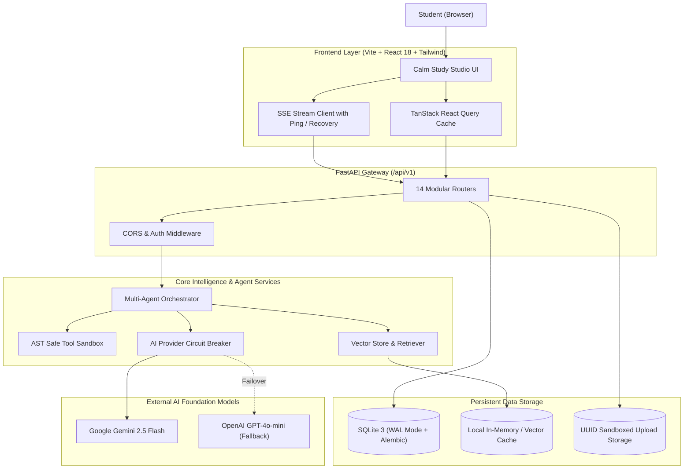

# ASIP V2.0 System Architecture

## 1. Executive Architecture Summary

The **Autonomous Student Intelligence Platform (ASIP V2.0)** is an autonomous, full-stack academic assistant combining:
- **Resilient AI Reasoning**: Dual-provider Circuit Breaker (`gemini-2.5-flash` primary with automatic fallback to `gpt-4o-mini` or `gemini-1.5-pro`).
- **Explainable Multi-Agent Orchestration**: State-machine execution pipeline (`RECEIVED` $\rightarrow$ `CLASSIFYING` $\rightarrow$ `PLANNING` $\rightarrow$ `TOOL_EXECUTION` $\rightarrow$ `SYNTHESIZING` $\rightarrow$ `SELF_EVALUATION` $\rightarrow$ `COMPLETED`).
- **Hardened Execution Environment**: Python Abstract Syntax Tree (AST) sandbox with safe node allowlisting, restricted built-ins, and execution time bounds.
- **Academic RAG Pipeline**: Ingestion pipeline with magic-byte MIME validation, SHA-256 deduplication, sliding-window chunking, and cosine similarity vector retrieval with verifiable citation excerpts.
- **Calm Study Studio Frontend**: React 18, TypeScript, Tailwind CSS, self-hosted typography, and SSE streaming with keepalive heartbeat and provider-switch recovery.
- **Dual Availability**: Full backward compatibility with the existing Streamlit Community Cloud frontend alongside the modular FastAPI/React stack.

---

## 2. Key Subsystems & Design

### 2.1 Dual AI Provider Manager with Circuit Breaker
- **Primary Model**: `gemini-2.5-flash` via official `google-genai` SDK.
- **Failover Chain**: `gemini-2.5-flash` $\rightarrow$ `gemini-1.5-pro` $\rightarrow$ `gpt-4o-mini`.
- **Circuit Breaker Logic**:
  - Failure threshold: 3 consecutive transient failures.
  - Recovery cooldown: 60 seconds half-open probe.
  - Mid-stream SSE recovery: sends `event: provider_switch` and resumes generation seamlessly.

### 2.2 Hardened AST Sandbox
- Parses Python tool expressions into an AST tree.
- Rejects dangerous AST nodes (`Import`, `ImportFrom`, `Exec`, `Global`, `AsyncFunctionDef`, `ClassDef`).
- Enforces an execution timeout and statement-depth limit ($< 100$).
- Disallows `eval`, `exec`, `open`, `__import__`, `os`, `sys`, and internal dunder attributes.

### 2.3 Document Ingestion & Vector Retrieval
- **Magic Bytes Validation**: Inspects binary headers (`%PDF-`, `PK\x03\x04`, etc.) preventing file spoofing.
- **UUID Isolated Storage**: Preserves original filename metadata while storing files on disk as `<uuid4>.<ext>`.
- **Status Lifecycle**: `UPLOADING` $\rightarrow$ `PROCESSING` $\rightarrow$ `INDEXING` $\rightarrow$ `READY` or `FAILED`.
- **Grounding Citations**: Evaluates chunk relevance and delivers page numbers, document names, and excerpt quotations.

### 2.4 Resilient SSE Streaming Protocol
- Route: `/api/v1/chat/stream`
- Content-Type: `text/event-stream`
- Events:
  - `start`: stream metadata and initial conversation context.
  - `trace`: real-time agent state transition and tool invocation telemetry.
  - `chunk`: incremental markdown token payload.
  - `citation`: validated source document reference with page numbers.
  - `provider_switch`: automated fallback notification upon primary provider failure.
  - `ping`: 15-second heartbeat keeping firewall connections alive.
  - `done`: completion marker with final token usage stats.
  - `error`: safe error message without credential leakage.

### 2.5 Database Schema & Migrations
- Managed via **Alembic** (`alembic/versions/`).
- Tables: `users`, `refresh_tokens`, `student_profiles`, `student_settings`, `subjects`, `syllabus_topics`, `documents`, `document_chunks`, `goals`, `tasks`, `study_plans`, `study_tasks`, `exam_attempts`, `exam_questions`, `exam_answers`, `memories`, `conversations`, `messages`, `agent_runs`, `tool_calls`.
- SQLite configured with `PRAGMA journal_mode=WAL` for high-concurrency read/write operations.
