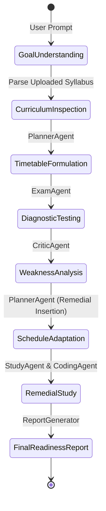

# ASIP System Architecture & Design Specification

## 1. Architectural Philosophy & Overview

The **Autonomous Student Intelligence Platform (ASIP)** is built upon an autonomous agent loop inspired by modern cognitive architectures. Rather than acting as a simple, stateless prompt-response wrapper, ASIP functions as an active educational partner.

### Core Architectural Principles:
1. **Local-First & Resilient:** Primary data persistence, indexing, and vector similarity run locally via SQLite and a pure-Python TF-IDF vector engine. External cloud API calls are isolated behind robust abstract provider interfaces.
2. **Explainable Multi-Agent Collaboration:** An AGI Controller (Orchestrator) manages specialized cognitive agents. Every sub-goal, tool call, reasoning step, and critic assessment is persisted with timestamps and durations.
3. **Safety by Construction:** Tools that execute code or calculations use strict Abstract Syntax Tree (AST) validation and execution sandboxes with resource limits.
4. **Closed-Loop Adaptation:** Assessment results directly feed back into goal planning, dynamically reshaping the student's daily study agenda.

---

## 2. Multi-Agent System Design

ASIP divides cognitive labor among 8 specialized agents, coordinated by an orchestrator that implements a bounded state machine:



### Agent Roles & Specifications:

| Agent Name | Primary Responsibility | Associated Tools | Fallback Behavior |
| :--- | :--- | :--- | :--- |
| **Orchestrator** | Coordinates agent lifecycle, state transitions, and context assembly | All registered tools | Self-contained state machine |
| **PlannerAgent** | Decomposes academic goals into tasks, dependencies, and daily timetables | `task_state_manager` | Linear rule-based milestone breakdown |
| **StudyAgent** | Synthesizes lecture notes, generates summaries, and explains concepts | `document_reader`, `semantic_search` | Direct curriculum synthesis |
| **CodingAgent** | Explains algorithms, generates code samples, and verifies runtime behavior | `python_sandbox` | Static syntax explanation |
| **MathAgent** | Solves numerical problems with step-by-step derivations | `calculator` | Analytical algebraic breakdown |
| **ResearchAgent** | Retrieves verified academic citations and domain references | `web_research` | Grounded local course notes lookup |
| **ExamAgent** | Generates diagnostic MCQs, coding challenges, and mock exams | `quiz_generator` | Syllabus-aligned question bank |
| **CriticAgent** | Assesses response quality, detects hallucinations, and flags retries | None (Metacognitive) | Rule-based quality heuristics |
| **MemoryAgent** | Manages short-term working context and sanitizes long-term memory | Database CRUD | In-memory session buffer |

---

## 3. Tool Sandboxing & Execution Security

Tools in ASIP inherit from `BaseTool` and register through `ToolRegistry`. Each execution is timed, wrapped in error boundaries, and logged to the `tool_calls` audit table.

### 3.1 Python Sandbox Security Protocol
The `python_sandbox` tool enforces multiple layers of isolation:
1. **AST Parse Validation:** Code is parsed into Python AST. Any `Import` or `ImportFrom` nodes referencing prohibited modules (`os`, `sys`, `subprocess`, `shutil`, `builtins`, `socket`, `pty`, `pathlib`, `http`) raise an immediate `SecurityError`.
2. **Prohibited Builtin Filtering:** Dynamic execution helpers such as `eval`, `exec`, `open`, `compile`, and `__import__` are stripped from execution globals.
3. **Execution Timeout:** The execution runs in a controlled thread with a hard limit (default: 3.0 seconds).
4. **Output Capture:** `sys.stdout` and `sys.stderr` are captured and capped to prevent memory exhaustion from infinite print loops.

### 3.2 Safe AST Mathematical Evaluator
The `calculator` tool parses strings using `ast.parse(expr, mode='eval')`. Only arithmetic nodes (`Add`, `Sub`, `Mult`, `Div`, `FloorDiv`, `Mod`, `Pow`, `USub`, `UAdd`) and approved mathematical constants/functions (`sqrt`, `sin`, `cos`, `tan`, `log`, `pi`, `e`, `abs`, `round`) are evaluated.

---

## 4. Storage & Retrieval Architecture

```
data/
├── ai_student_copilot.db     # SQLite Database (15 Relational Tables)
├── uploads/                  # Raw User Files (.pdf, .docx, .txt, .md, .csv)
└── vector_store/             # Persistent TF-IDF Inverted Index & Chunk Store
```

### Relational Schema Design:
- **`User` & `StudentProfile`**: Stores student credentials, target grade, learning velocity, and daily study hours.
- **`Subject` & `Topic`**: Hierarchical course catalog with prerequisites and difficulty levels.
- **`Document`**: Metadata for uploaded course materials, file checksums, and chunk references.
- **`Goal` & `Task`**: High-level learning objectives and concrete daily study tasks with statuses (`pending`, `in_progress`, `completed`, `adapted`).
- **`AgentRun` & `ToolCall`**: Audit logs capturing agent reasoning steps, tool parameters, runtimes, and outputs.
- **`Memory`**: Long-term key-value personalizations with automatic secret/credential redaction.
- **`Quiz`, `Question`, `Answer`, `ExamAttempt`**: Full testing framework recording student choices, grading scores, and rubrics.
- **`ProgressRecord` & `Evaluation`**: Longitudinal mastery tracking for weakness detection and predictive readiness calculations.

---

## 5. 15-Step Autonomous Workflow Engine

The `AutonomousWorkflowService` orchestrates the complete exam preparation pipeline without requiring manual intervention between steps:

1. **Step 1: Goal Understanding & Semantic Framing** — Parses student intent, target subject, timeframe (e.g., 7 days), and desired grade.
2. **Step 2: Document Inspection & Material Grounding** — Scans uploaded syllabus and question papers to establish truth grounding.
3. **Step 3: Curriculum Topic Extraction & Difficulty Mapping** — Discovers key subject modules and maps them to cognitive domains.
4. **Step 4: Initial Day-by-Day Schedule Formulation** — Generates a balanced daily timetable fitting the available days.
5. **Step 5: Multi-Agent Task Delegation** — Assigns reading, coding, and mathematical subtasks to specialized agents.
6. **Step 6: Diagnostic Quiz Generation** — Creates a multi-topic quiz to test baseline competency.
7. **Step 7: Automated Assessment & Evaluation** — Grades student answers and calculates per-topic mastery scores.
8. **Step 8: Weakness Detection & Diagnostic Analysis** — Identifies concepts scoring below the passing threshold (60%).
9. **Step 9: Dynamic Timetable Adaptation** — Flags weak topics and restructures subsequent schedule days.
10. **Step 10: Remedial Task Insertion** — Injects targeted review sessions and hands-on coding exercises for identified gaps.
11. **Step 11: Targeted Concept Review & Remediation** — Prompts the `StudyAgent` and `CodingAgent` to produce focused remedial guides.
12. **Step 12: Targeted Re-Testing & Mastery Update** — Generates a follow-up assessment to measure student recovery.
13. **Step 13: Long-Term Memory & Profile Storage** — Persists sanitized mastery metrics and study preferences.
14. **Step 14: Comprehensive Exam Readiness Report** — Synthesizes readiness scores, projected exam grade, and downloadable HTML/MD reports.
15. **Step 15: Explainable Execution Trace Assembly** — Compiles all agent thoughts, tool logs, and execution latencies into an inspectable audit trail.
